## Material-X

My stash for all things material, animations, transitions, Animated VD, Color Palette API, UI design 
and more.

## Table of Contents

- [Typography](#typography)
- [Buttons](#buttons)
   - [Material Buttons](#material-buttons)
   - [Floating Action Buttons](#floating-action-buttons)
- [Color Palette](#color-palette)
- [Animations](#animations)
   - [Android APIs](#android-apis)
   - [Lottie](#lottie)
- [Input](#input)
- [Bottom Navigation](#bottom-navigation)
- [Grids](#grids)
- [Attributions](#attributions)
- [References](#references)
- [License](#license)

### Typography

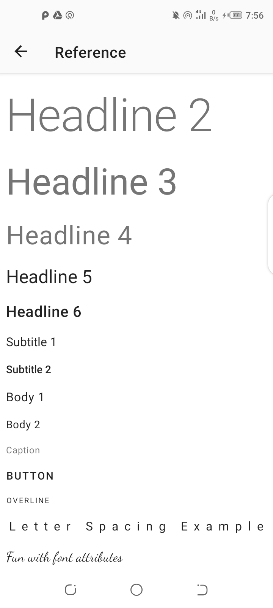 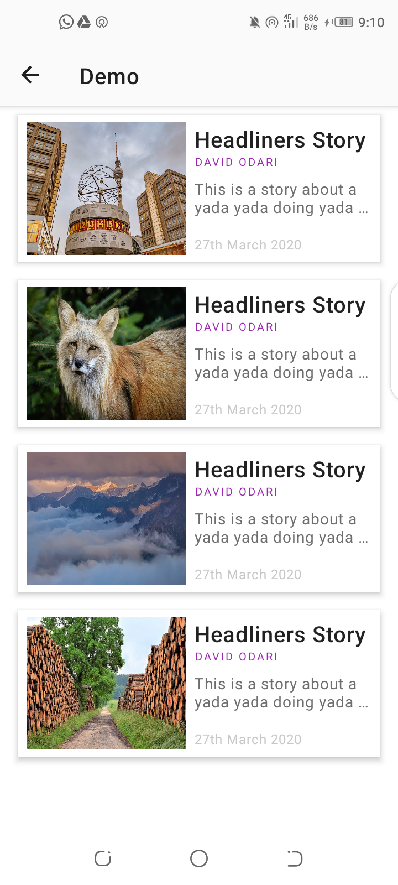

### Buttons

#### Material Buttons

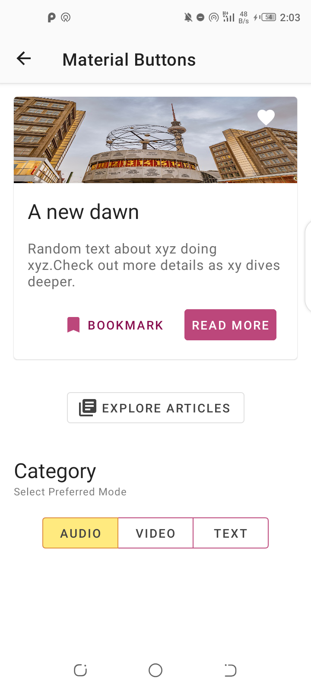

#### Floating Action Buttons

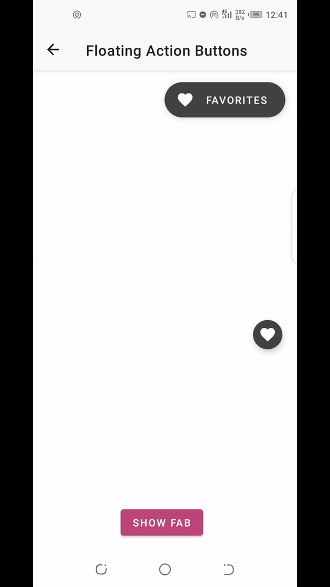

### Color Palette

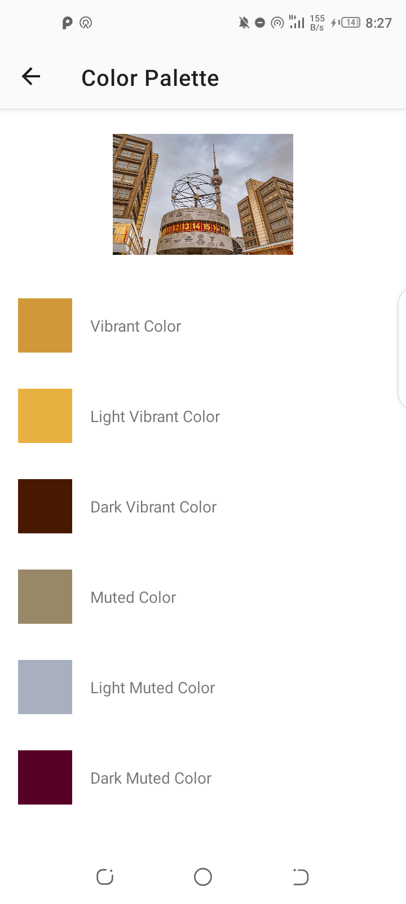 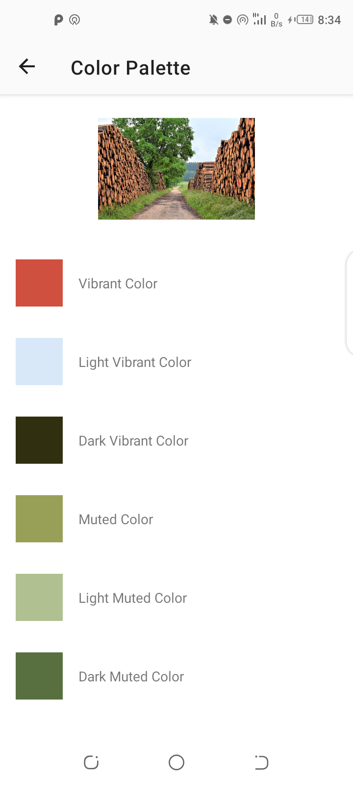

### Animations

#### Android APIs

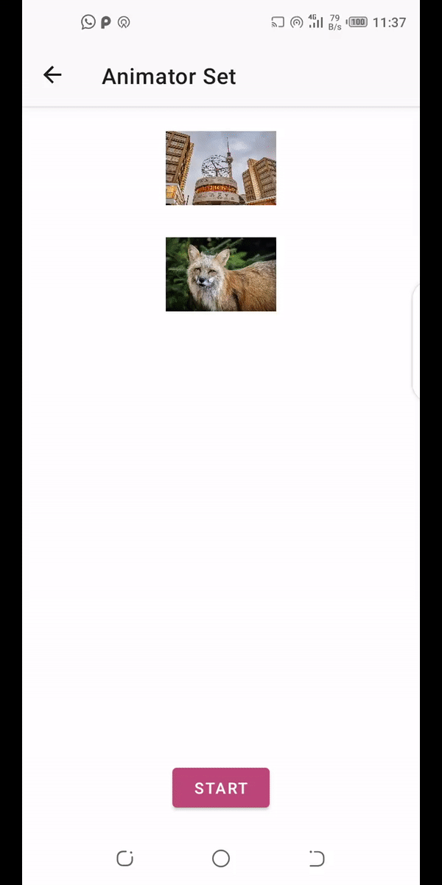 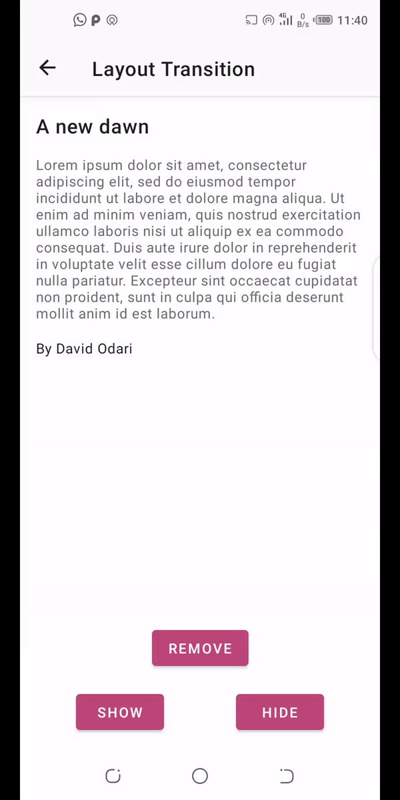 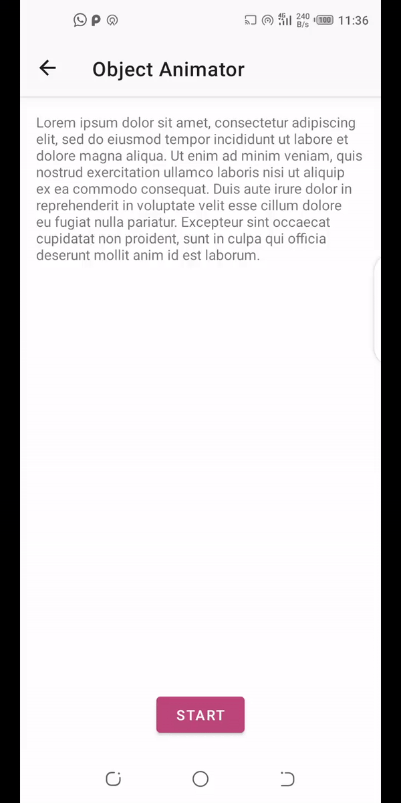 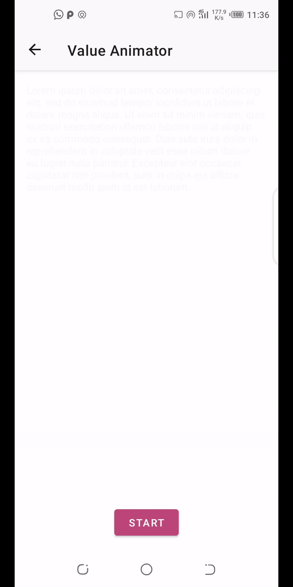

#### Lottie

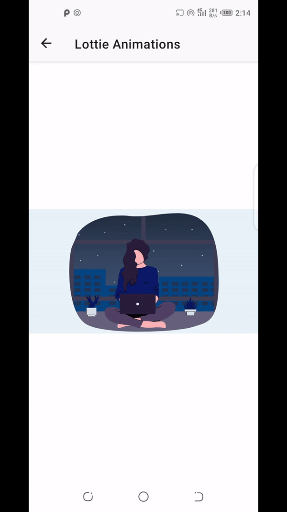

### Input 

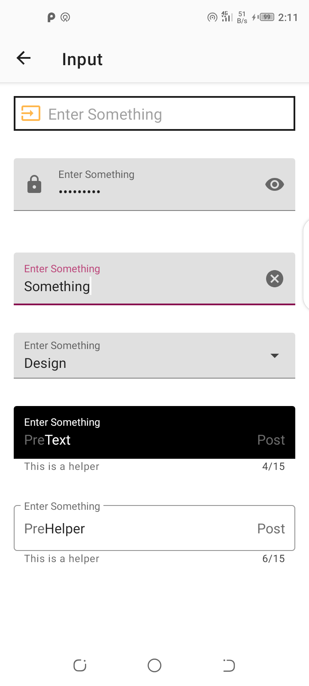

### Bottom Navigation

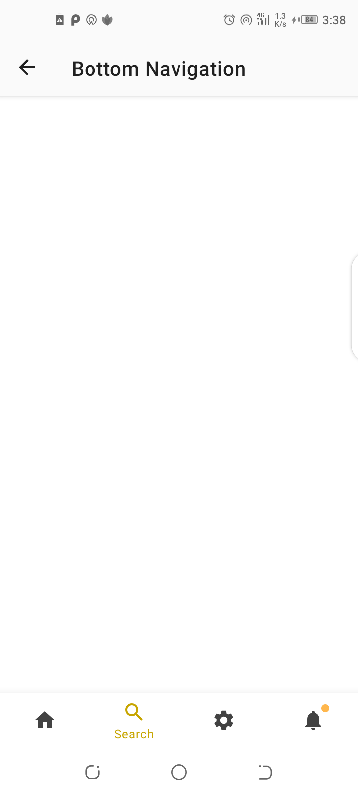

### Grids

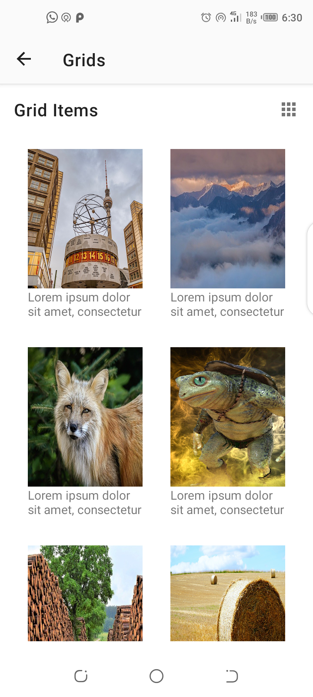 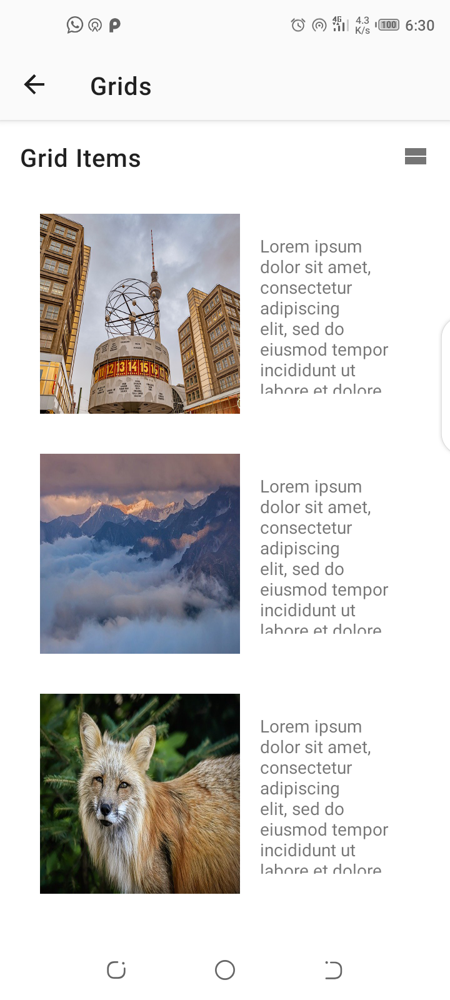 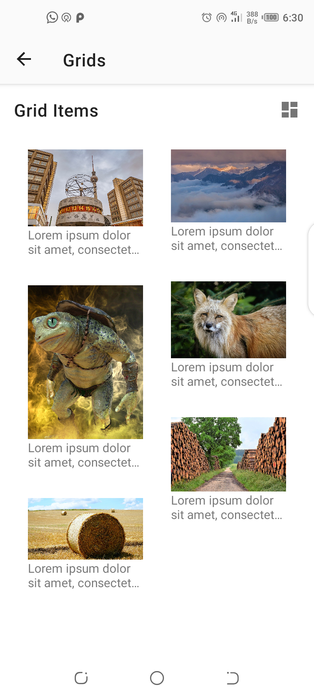

### References

- [Material Design Docs](https://material.io/develop/android)
- [Material Color Tool](https://material.io/resources/color/#!/?view.left=0&view.right=0)
- [Animations](https://developer.android.com/training/animation)

### Libraries

- [Jetpack](https://developer.android.com/jetpack)
- [Material Design](https://material.io/develop/android/docs/getting-started/)
- [Lottie](https://github.com/airbnb/lottie-android)

### Attributions

Images by :

- <a href="https://pixabay.com/users/RitaE-19628/?utm_source=link-attribution&amp;utm_medium=referral&amp;utm_campaign=image&amp;utm_content=5311293">RitaE</a>,
- <a href="https://pixabay.com/users/WagnerAnne-12610361/?utm_source=link-attribution&amp;utm_medium=referral&amp;utm_campaign=image&amp;utm_content=5289802">WagnerAnne</a>
- <a href="https://pixabay.com/users/Alexas_Fotos-686414/?utm_source=link-attribution&amp;utm_medium=referral&amp;utm_campaign=image&amp;utm_content=5303221">Alexas_Fotos</a>
- <a href="https://pixabay.com/users/mystraysoul-10217405/?utm_source=link-attribution&amp;utm_medium=referral&amp;utm_campaign=image&amp;utm_content=5299607">Полина Андреева</a>
- <a href="https://pixabay.com/users/Syaibatulhamdi-13452116/?utm_source=link-attribution&amp;utm_medium=referral&amp;utm_campaign=image&amp;utm_content=5383607">Syaibatul Hamdi</a> 
- <a href="https://pixabay.com/users/matthiasboeckel-3930681/?utm_source=link-attribution&amp;utm_medium=referral&amp;utm_campaign=image&amp;utm_content=5388631">Matthias Böckel</a>

from <a href="https://pixabay.com/?utm_source=link-attribution&amp;utm_medium=referral&amp;utm_campaign=image&amp;utm_content=5289802">Pixabay</a>
 
### License

```

   Copyright 2020 David Odari.

   Licensed under the Apache License, Version 2.0 (the "License");
   you may not use this file except in compliance with the License.
   You may obtain a copy of the License at

       http://www.apache.org/licenses/LICENSE-2.0

   Unless required by applicable law or agreed to in writing, software
   distributed under the License is distributed on an "AS IS" BASIS,
   WITHOUT WARRANTIES OR CONDITIONS OF ANY KIND, either express or implied.
   See the License for the specific language governing permissions and
   limitations under the License.
   
 ```
